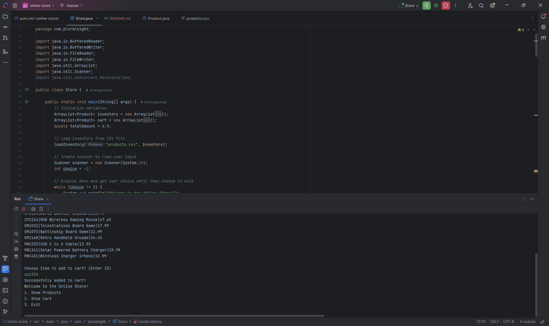

# Project Title
Online Shop
## Description of the Project

This application allows user to shop the online inventory. Users can add item to cart by typing in the item ID, Remove Item from cart, and Pay for Item at checkout. 

## User Stories

List the user stories that guided the development of your application. Format these stories as: "As a [type of user], I want [some goal] so that [some reason]."

- As a user, I would like to see all Items in inventory, so I can shop for items.
- As a user, I would like to search Items by ID, so that I can see if they are available in the inventory.
- As a user, I would like to add Items from inventory to my cart, so that I can check out.
- 

## Setup

1.) Create a new project, Project Title: Online Store
2.) Check create GitHub repo
3.) Ensure that Maven is builder
4.) Ensure Java 17 is language
5.) Click create and the add new package
6.) Add classes needed for inventory
7.) Add Inventory.csv 

### Prerequisites

- IntelliJ IDEA: Ensure you have IntelliJ IDEA installed, which you can download from [here](https://www.jetbrains.com/idea/download/).
- Java SDK: Make sure Java SDK is installed and configured in IntelliJ.

### Running the Application in IntelliJ

Follow these steps to get your application running within IntelliJ IDEA:

1. Open IntelliJ IDEA.
2. Select "Open" and navigate to the directory where you cloned or downloaded the project.
3. After the project opens, wait for IntelliJ to index the files and set up the project.
4. Find the main class with the `public static void main(String[] args)` method.
5. Right-click on the file and select 'Run 'YourMainClassName.main()'' to start the application.

## Technologies Used

- Java: 17.
- IntelliJ.
- GitHub & GitHub projects
- GitBash

## Demo

## Future Work
- Integrate a GUI
- Let user use different payment methods
- Put items in respective Department
- Allow user to switch Departments
- Create an out-of-stock parameter

## Resources
- Workbook 3 - 1 - Mastering Java Fundamentals v2.2Y
- Workbook 3 - 3 - GitHub and Repository Management v6.1Y
- https://github.com/RayMaroun/yearup-spring-section-10-2025/tree/master/pluralsight/java-development/workbook-3
## Team Members
- **Emanuel Galloway** - Project owner/Software Developer.
## Thanks

- Thank you to Professor Raymond for continuous support and guidance.
- A special thanks to all teammates for their dedication and teamwork.
 